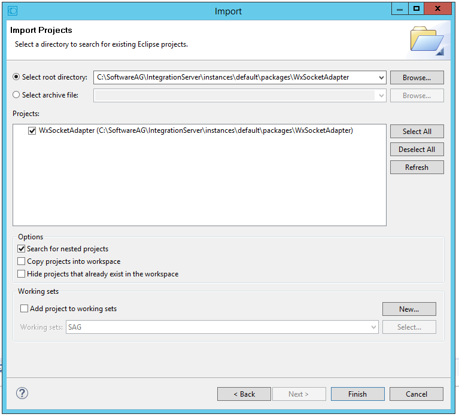
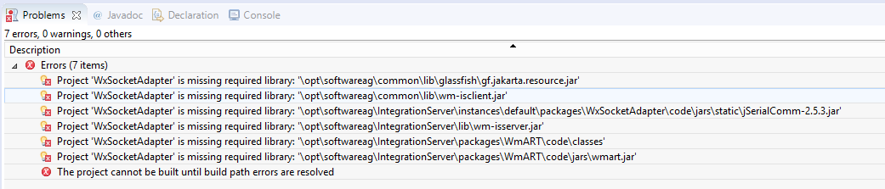
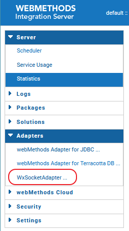
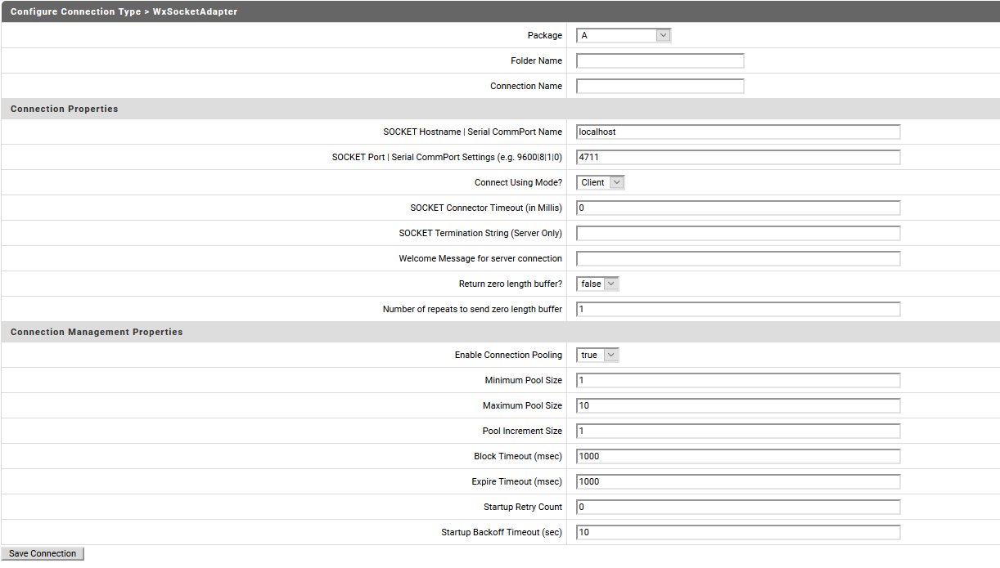

# WxSocketAdapter

This Socket Adapter project covers two demands of advanced Integration Server users and developers:
1. Demoing how to develop a custom coded on-premise Intgeration Server adapter.
2. Providing a light-weight way to connect low level devices and applications into the world of Integration Server.

This adapter deploys 3 ways of conneting to the Integration Server it is running on:

* TCP/IP client connectivity
* TCP/IP server connectivity
* Serial communication connectivity

A detailed sample presentation of the functionality providing screen shots can be viewed under Software AG's TECHCommunity (see link below).

# Prerequisites

* SAG's Integration Server (IS) or Microservices Runtime (MSR) version 10.5 or later is installed on your local machine.
* SAG's Designer (DES) - with perspective "Service Development" enabled - version 10.5 or later is installed on your local machine.
* At least the following packages are installed and enabled on the local IS:
    * WmRoot
    * Default
    * WmART
    * WmPublic
* You applied the latest fixes for IS, MSR, and DES.
* You know where to find the following jars and paths on your local machine:
    * gf.jakarta.resource.jar (usually in <WM_ROOT>\common\lib\glassfish) (in v10.3 the file is named gf.javax.resource.jar)
    * wm-isclient.jar (usually in <WM_ROOT>\common\lib)
    * jSerialComm-2.5.3.jar (provided withing this project under WxSocketAdapter\code\jars\static)
    * wm-isserver.jar (usually in IntegrationServer\lib)
    * WmART\code\classes (usually pointing to <WM_ROOT>\IntegrationServer\...\packages\WmART\code\classes)
    * wmart.jar (usually in <WM_ROOT>\IntegrationServer\instances\<INSTANCE_NAME>\packages\WmART\code\jars\)
* To see immediate results coming from the socktes, make sure you can receive messages with your Integration Server. So, if you are not connected to an Universal Messaging, make sure your "webMethods Messaging Settings" of your IS is **"IS_LOCAL_CONNECTION"** (use "Change Default Connection Alias" to do so). 


# Installation

1. Clone this project into a local temporary directory
2. Copy the subdirectory "WxSocketAdapter" below directory "webmethods-integrationserver-wxsocketadapter" into your IS package directory:
    - for MSR: <WM_ROOT>\IntegrationServer\packages.
    - for IS: <WM_ROOT>\IntegrationServer\instances\<INSTANCE_NAME>\packages
3. Open DES, switch to "Java" perspective and import the WxSocketAdapter project from IS package directory
```
(Eclipse->file->import->General->Existing Projects Into Workspace).
```

4. In the Problems View you will see now a list of "missing required libraries" errors.


5. Resolve these errors by running "Configure Build Path ..." (right-click on the project -> Build Path -> Configure ) for this project by adding/editing the external jars and class folders.
6. After all errors are resolved the adapter is ready to use.
7. **Restart your IS/MSR** in order to see and use the adapter.


# Configuration/Usage



The configuration parameters have the following meanings:
  
| Property Name | Description |
| ------ | ------ |
| Package | The IS package name. |
| Folder Name | An existing folder in IS. Use the DES copy'n paste functionality.|
| Connection Name | The name of the connection. The connection will showup under this name in DES. Don't use white space or special characters.
| SOCKET Hostname &#124; Serial CommPort Name | The hostname or IP address for TCP/IP connections or serial comm port to which the adapter shall connect to (serial comm ports are e.g. /dev/ttyACM0 for linux and com3 for windows).
| SOCKET Port &#124; Serial ComPort Settings | The TCP/IP port or the settings for the comm port. The settings for serial comm port seperated by &#124; have following meanings: speed of comm port &#124; number of data bits &#124; number of stop bits &#124; parity mode. A value of 9600&#124;8&#124;1&#124;0 has the follwing meaning: 9600 bit/sec, 8 data bits, 1 stop bit, and no parity. |
Connect Using Mode? | Choose one from the following connection modes: client, server, serial.|
SOCKET Connector Timeout (in Millis) | Specify the maximum time to wait for a connection in milliseconds (a value of 0 wait forever). |
Welcome Message for server connection | If this adapter connection is running in server mode and a client connects, this string is send as the first message to the client.|
SOCKET Termination String (Server only) | Usually a server socket connection cannot detect when a client is disconnected. If the client sends this termination string before it deconnects from this server, this server socket goes back into reconnection mode, so the client can reconnect.|
Return zero length buffer? | If set to true, the IS notification service, associated with this connection will receive at least one zero length buffer. If a client connects, but is sending no data for a long time, or no data at all. This can happen with e.g. surveillance cameras running the rtsp protocol. **Important**: The zero length buffer is not necessarilly comming  as the first message.|
Number of repeats to send zero length buffers | To avoid floading the associated notification service with zero length buffer, you can determine how many times a zero length buffer is sent to the notification service.|
| ... | The following parameters are standard params as described in the webmethods documentation.|


# Test

```javascript

var net = require('net');
var client  = new net.Socket();
client.connect({
  port:4711
});

client.on('connect',function(){
  console.log('Client: connection established with server');

  console.log('---------client details -----------------');
  var address = client.address();
  var port = address.port;
  var family = address.family;
  var ipaddr = address.address;
  console.log('Client is listening at port' + port);
  console.log('Client ip :' + ipaddr);
  console.log('Client is IP4/IP6 : ' + family);


  // writing data to server
  client.write('hello from client');

});

```


## 3rd Party License
The following 3rd party libraries are used within the adapter:

* jSerialComm-2.5.3.jar - please find license agreements under: https://github.com/Fazecast/jSerialComm

***

These tools are provided as-is and without warranty or support. They do not constitute part of the Software AG product suite. Users are free to use, fork and modify them, subject to the license agreement. While Software AG welcomes contributions, we cannot guarantee to include every contribution in the master project.

Contact us at [TECHcommunity](mailto:technologycommunity@softwareag.com?subject=Github/SoftwareAG) if you have any questions.

